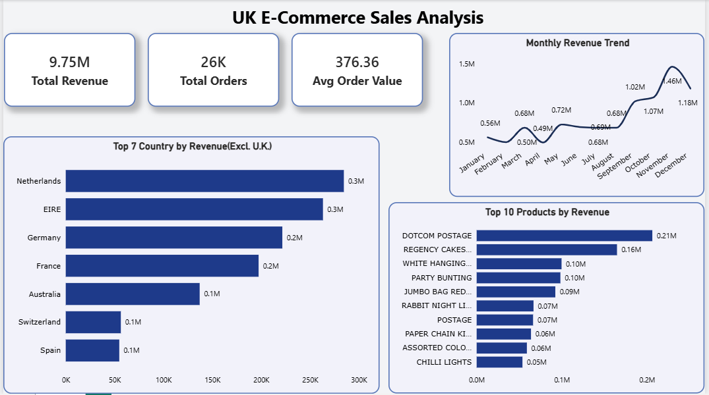

# 📊 End-to-End E-Commerce Data Analytics Project
### **PostgreSQL ➡️ Power BI ➡️ Microsoft Excel**

---

## 📌 Project Workflow Overview
This end-to-end data analytics project analyzes over **500,000+ transactional sales records** from an international e-commerce dataset across a 3-stage analytics pipeline:

```
[ PostgreSQL Database ]  ➡️  [ Power BI Views & Dashboard ]  ➡️  [ Excel Deep Dive & Prototyping ]
  (Database Querying)           (Interactive Business BI)          (Data Cleaning & Logic)
```

---

## 🗄️ Step 1: PostgreSQL Data Analysis & Views
The project began by setting up a relational database in **PostgreSQL** to handle large-scale transactional data efficiently.

* **Database & Table Setup:** Created schemas and imported 500K+ raw records.
* **Views & Aggregations Created:** Created database `VIEW`s to feed directly into Power BI without slowing down queries.
* **Key SQL Operations Used:** Window Functions (`DENSE_RANK`), Aggregations (`SUM`, `COUNT`), Grouping, and Date formatting.

```sql
-- View Created for Power BI Integration
CREATE VIEW v_monthly_sales_summary AS
SELECT 
    TO_CHAR(invoice_date, 'YYYY-MM') AS month_year,
    country,
    COUNT(DISTINCT invoice_no) AS total_orders,
    SUM(quantity) AS total_quantity,
    ROUND(SUM(quantity * unit_price)::numeric, 2) AS total_revenue
FROM sales_data
GROUP BY 1, 2;
```

---

## 📊 Step 2: Power BI Views & Dynamic Dashboard
Next, Power BI was connected directly to the **PostgreSQL Views** for dynamic reporting and data visualization.

* **Data Modeling & Views Integration:** Connected PostgreSQL database via DirectQuery/Import mode using custom SQL Views.
* **DAX Formulas Created:** Built key metrics for Revenue Growth, AOV (Average Order Value), and Year-over-Year calculations.
* **Visuals Included:**
  * **KPI Cards:** Total Revenue, Total Orders, Units Sold.
  * **Geographical Sales Map:** Revenue distribution across international markets (UK, Germany, France, Australia).
  * **Monthly Trend Chart:** Identifying seasonality and peak revenue periods.


*Figure 1: Power BI Interactive Sales Dashboard connected to PostgreSQL Views*

---

## 🔍 Step 3: Excel Data Cleaning, Formulas & KPI Reporting
Finally, **Microsoft Excel** was used to perform granular data cleaning, error troubleshooting, and summary prototyping.

### **Key Technical Challenges & Solutions Solved in Excel:**
1. **Pivot Table Date Grouping Error ("Cannot Group Selection"):**
   * *Problem:* `InvoiceDate` contained mixed data types and timestamps (`1/13/2011 10:04`), preventing monthly grouping.
   * *Solution:* Applied **Text to Columns** with a *Space* delimiter to separate timestamps, reformatted to `Date (MDY)`, and used `=DATE(YEAR(), MONTH(), 1)` for clean chronological sorting (`Dec-2010` to `Dec-2011`).
2. **Handling Price Variance in Lookups:**
   * *Problem:* Products like `REGENCY CAKESTAND 3 TIER` had multiple unit prices across orders.
   * *Solution:* Analyzed behavior between `VLOOKUP` (first match) vs `INDEX-MATCH` (bottom match) and applied `AVERAGEIFS` and `SUMIFS`.
3. **KPI Visualization:** Applied **Conditional Formatting (Data Bars)** directly on Pivot Tables for clear visual summary.


*Figure 2: Excel Summary Table with Data Bars Visualization*

---

## 📁 Repository Files
* `archive.zip` — Compressed Kaggle Dataset (500K+ records)
* `PostgreSQL_Queries.sql` — SQL Scripts & Views Creation
* `PowerBI_Sales_Dashboard.pbix` — Interactive Power BI Dashboard
* `images/` — Dashboard & Excel Visual Screenshots
* `README.md` — Full Project Documentation
